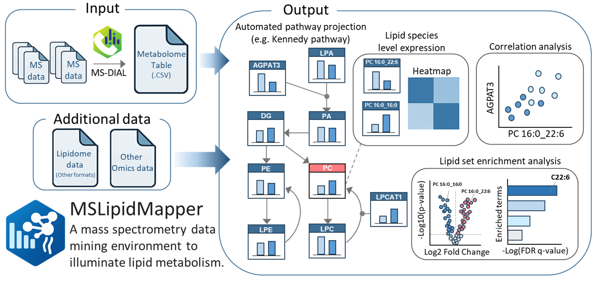

# MSLipidMapper

<p align="center">
  
</p>

MSLipidMapper is an interactive Shiny workspace for lipidomics analysis.
Uploaded data are converted to
`SummarizedExperiment` objects and used throughout normalization, exploratory
analysis, differential analysis, acyl-chain analysis, enrichment, and
Cytoscape.js-based pathway visualization.

MSLipidMapper accepts processed abundance tables. It does not process raw mass
spectrometry files.

## Main features

- Import an MS-DIAL Alignment Table CSV
- Import an MS-DIAL mzTab-M file directly
- Import generic sample-by-lipid data with a separate lipid-to-Ontology table
- Edit sample metadata and include or exclude samples from analysis
- Normalize abundances and export normalized data
- Visualize lipidomics data interactively
- Perform enrichment and acyl-chain-level analysis
- View, edit, and export Cytoscape.js pathway networks
- Render pathway PDFs from the command line without starting Shiny

## Installation

### Install as an R package

R 4.3 or later is required. Install the Bioconductor dependencies first, then
install MSLipidMapper from GitHub.

```r
install.packages(c("BiocManager", "remotes"))

BiocManager::install(c(
  "SummarizedExperiment",
  "S4Vectors",
  "ComplexHeatmap",
  "clusterProfiler",
  "GO.db",
  "ropls",
  "rgoslin"
), ask = FALSE, update = FALSE)

remotes::install_github(
  "systemsomicslab/MSLipidMapper",
  dependencies = TRUE
)
```

Launch the application with:

```r
MSLipidMapper::run_mslipidmapper()
```

The Shiny application uses port `3838` by default. Bundled example files,
pathway networks, and `lipid_rules.yaml` are installed with the package.

### Run with Docker

Docker Desktop or another Docker runtime must already be running.

```bash
git clone https://github.com/systemsomicslab/MSLipidMapper.git
cd MSLipidMapper
docker build -t mslipidmapper .
docker run --rm -p 3838:3838 -p 7310:7310 mslipidmapper
```

Open:

- Shiny application: `http://localhost:3838`
- Plot/static asset API: `http://localhost:7310`

On Windows, `MSLipidMapper.bat` builds and starts the container. Docker Desktop
must be running before the launcher is used.

## Lipidomics input

Choose one of the following formats on the Upload page.

### MS-DIAL Alignment Table CSV

Upload an Alignment Table exported by MS-DIAL as CSV. MSLipidMapper reads the
MS-DIAL annotation fields and sample abundance columns and builds an
analysis-ready `SummarizedExperiment`.

The current loader expects the standard MS-DIAL Alignment Table layout,
including its multi-row header and annotation columns. A manually simplified
CSV should be imported with the Generic option instead.

### MS-DIAL mzTab-M

Upload an MS-DIAL mzTab-M file (`.mztab` or `.mzTab`) directly. MSLipidMapper
reads the abundance data, sample information, and lipid annotations and builds
the same analysis-ready structure used by the other input formats.

### Generic CSV with Ontology table

Generic import uses two files.

#### Assay CSV

The assay table is arranged as samples by lipids:

| sample_id | class | PC 34:1 | PE 36:2 |
|---|---|---:|---:|
| Sample_1 | Control | 1200 | 820 |
| Sample_2 | Treatment | 950 | 1100 |

- one row per sample
- one `sample_id` column
- an optional `class` column
- all remaining selected columns are numeric lipid abundances

#### Feature/Ontology CSV

The feature table maps assay column names to lipid Ontology values:

| lipid | Ontology |
|---|---|
| PC 34:1 | PC |
| PE 36:2 | PE |

Lipid names must match the abundance-column names in the assay CSV.


## Command-line pathway mapping

Pathway PDFs can be generated from a YAML configuration without starting the
Shiny application. A complete example is installed at
`inst/extdata/examples/pathway-cli.yml`.

From an installed package:

```bash
Rscript -e "quit(status=MSLipidMapper::mslipidmapper_cli(commandArgs(TRUE)))" pathway --config parameters.yml
```

From a source checkout after installing the package:

```bash
Rscript inst/scripts/mslipidmapper.R pathway --config inst/extdata/examples/pathway-cli.yml
```

Input, network, and output paths can be overridden at execution time:

```bash
Rscript inst/scripts/mslipidmapper.R pathway \
  --config parameters-mztab.yml \
  --input data/results.mzTab \
  --network pathways/custom.cyjs \
  --output results/custom-pathway.pdf
```

Useful options:

- `--input`: overrides the lipidomics input path
- `--network`, `--cyjs`, or `-n`: uses one custom network
- `--output` or `-o`: overrides the PDF file or output directory
- `--acyl-chains` or `-a`: retains molecules containing exact acyl chains
- `--acyl-match`: selects `any` or `all` matching for multiple chains

The CLI accepts both MS-DIAL Alignment Table CSV and MS-DIAL mzTab-M input.

When no custom network is specified, the bundled remodeling, ceramide, and
global pathway networks are rendered. The YAML file controls normalization,
group inclusion or exclusion, plot type (`dot`, `box`, or `violin`), colors,
fonts, and output dimensions. Chrome or Chromium is required for network PDF
rendering; use `pathway.browser` or the `MSLIPIDMAPPER_BROWSER` environment
variable if it is not detected automatically.

Molecule-level acyl-chain filtering can also be set in YAML with
`analysis.acyl_chain_filter.chains` and `match: any|all`. It is applied before
normalization and lipid-class aggregation. Only explicitly parsed acyl chains
are matched: total-composition names such as `PC 34:1` are not guessed, and
sphingoid bases are not treated as acyl chains.

## Example data

Examples are available in `inst/extdata/examples/` and can be located from an
installed package with:

```r
example_dir <- system.file("extdata", "examples", package = "MSLipidMapper")
list.files(example_dir, recursive = TRUE)
```

Bundled examples include MS-DIAL-style lipidomics data, sample metadata,
Cytoscape networks, a pathway CLI configuration, and example pathway PDFs.

## License

See [LICENSE](LICENSE).
